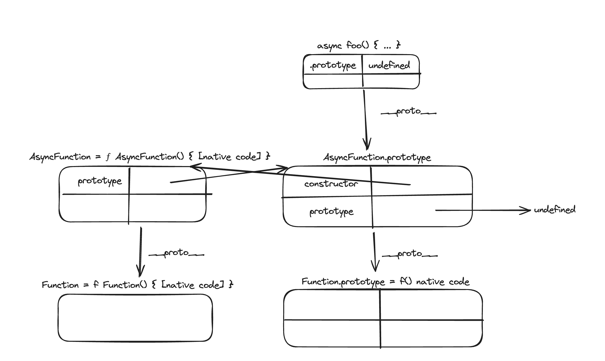

## Async function vs Async Generator function

### Async function (normal async function has no *)

```js
// creates an AsyncFunction named foo
async function foo() {
    return 1;
}
```

An async function declaration creates an `AsyncFunction` object. 

Each time when an async function is called, it returns a new Promise which will be resolved with the value returned by the async function, or rejected with an exception uncaught within the async function.

#### Return value of a async function is always a promise

Async functions always return a promise. If the return value of an async function is not explicitly a promise, it will be implicitly wrapped in a promise.

**Note** - **Even though the return value of an async function behaves as if it's wrapped in a `Promise.resolve`, they are not equivalent.**

An async function will return a different reference, whereas `Promise.resolve` returns the same reference if the given value is a promise.

```js
const p = new Promise((resolve, reject) => {
    setTimeout(() => {
        resolve('Hello World')
        }, 20000)}
    );

const p1 = Promise.resolve(p);
const p2 = async function(){ return p; }()

console.log(p1 === p); // true - Promise.resolve returns the same promise
console.log(p2 === p); // false - async function returns new promise
console.log(p1 === p2); // false
```


#### AsyncFunction object

We do not have access to AsyncFunction, i.e. it is not a Glbobal.

**AsyncFunction instances do not have the prototype property or the `[[Prototype]]` internal slot.**

To get AsyncFunction object, we can use `Object.getPrototypeOf(async function(){}).constructor`

```js
const AsyncFunction = async function () {}.constructor;
```

Hierarchy:



### Generator function (normal generator function has no async keywrod)

Calling genFunc does not execute its body. 
Instead, you get a so-called generator object

`genFunc()` is initially suspended before the body (line A). The method call genObj.next() continues execution until the next yield:

```js
function* genFunc() {
    // (A)
    console.log('First');
    yield; // (B)
    console.log('Second'); // (C)
}

// > const genObj = genFunc();

// > genObj.next()
// First
// { value: undefined, done: false }

// > genObj.next()
// Second
// { value: undefined, done: true }
```

### Async Generator function (async generator function has *)

An async generator combines the features of a async function and a generator function. 

An `async function*` declaration creates an `AsyncGeneratorFunction object`. 
Each time when an async generator function/object is called, it returns a new `AsyncGenerator` object, which conforms to the async iterator protocol.

```js
// async generator function
async function* foo() {
    yield 1;
}
const asyncGenObj = foo();
```
```