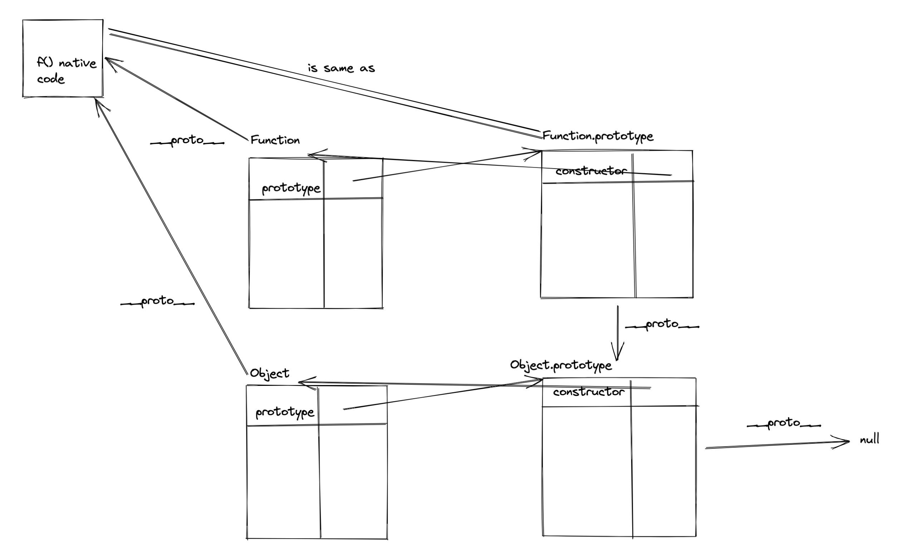

Every JavaScript function is actually a Function object. 

This can be seen with the code `(function () {}).constructor === Function`, which returns true.

- `[[Prototype]]` as per specification is accessible via `__proto__` in mordern browsers. Should be referred to as "**protoLink**" instead to avoid confusion with "prototype" property on function object
- What does `Object.create(arg)` do?
    - Helps you create a **protoLink(**`__proto__`) **to** **arg** along with the created object.
- What does **new** keyword do?
    - Create an object via `Object.create(ConstructorFunction.prototype)` (setting up protoLink for created objects).
        - ProtoLink setup simultaneously with obj creation ☝🏼
    - Make it refereable as `this` inside ConstructorFunction
    - return it automatically at the end of the ConstructorFunction
- What happens when I declare a simple function `function f(){}`?
    - It is a function/object combo with `prototype` property, referred by `f.prototype` if needed.
    - `typeof f` is a function (not object)
    - `f.hasOwnProperty('prototype')` is true
    - `f.constructor` is not f itself, but the constructor function that created `f`, which is actually `Function`
    - `f.hasOwnProperty('constructor')` is false, because it lives on `f.prototype`, not on `f` itself.
    - `f.prototype.hasOwnProperty('constructor')` is true, because constructor property lives on `f.prototype`.
    - `f's protoLink` is setup to `Function.prototype` to get some useful methods like `call`, `apply`, `bind`. (All function instance protolink refers this common methods)

- All functions are actually function objects i.e (**Function object combo**, having a prototype property in the object part) i.e what function expression returns are `Function` objects having all the usual properties like `call`, `apply` and `bind`
    
    ```jsx
    (function(){}).constructor === Function
    ```
    
- Function constructor is also Function
    
    ```jsx
    Function.constructor === Function
    ```
    
- Object constructor is Function
    
    ```jsx
    Object.constructor === Function
    ```
    
- Function objects `[[prototype]]` is defined as `Function.prototype`
    
    ```jsx
    (function(){}).__proto__ === Function.prototype
    ```
    
## Why `Object instanceof Function === true` and `Function instanceof Object === true`

https://stackoverflow.com/questions/23622695/why-in-javascript-both-object-instanceof-function-and-function-instanceof-obj




## function declarations scoping

Function declarations (**in strict mode**)

* are **block-scoped**, like `let`, (but in non-strict mode they hoist to function scope).
* create properties in the global object (while in global scope), like `var`.
* **are hoisted to top of block**: independently of where a function declaration is mentioned in its scope, it is always created at the beginning of the scope.
```js
{ // Enter a new scope

    console.log(foo()); // OK, due to hoisting
    function foo() {
        return 'hello';
    }
}
```

Beware of conditional function declarations: https://developer.mozilla.org/en-US/docs/Web/JavaScript/Reference/Statements/function#conditionally_created_functions


In strict mode:
```js
"use strict"; if (true) {
  function foo() {
    console.log('BFE')
  }
}
if (false) {
  function bar() {
    console.log('dev')
  }
}

foo() // foo is not defined
bar()
```

## defining function that takes callback convention

If you are defining a function that has to return its control flow via a callback, 
then it should take in callback as the last argument.
You can see some example APIs here: https://nodejs.org/api/fs.html#callback-api
or https://expressjs.com/en/api.html#app.listen
or https://nodejs.org/api/dns.html#dnsgetservers
or https://mongoosejs.com/docs/api.html#model_Model-find
or https://nodejs.org/api/http.html#httprequestoptions-callback
e.g.
```js
function doesSomethingAndReturnViaCb(...args, cb) {// return control flow via cb, should be last argument
    doSomethingWithArgs(args);
    cb();// return control flow via cb
}
```

## Class declarations vs function declarations

Class declarations…

* are block-scoped.
* don’t create properties on the global object.
* **are not hoisted.**

The rationale for this behavior is that the values of their extends clauses are defined via expressions and those expressions have to be executed at the appropriate times.

```js
{ // Enter a new scope

    const identity = x => x;

    // Here we are in the temporal dead zone of `MyClass`
    const inst = new MyClass(); // ReferenceError

    // Note the expression in the `extends` clause
    class MyClass extends identity(Object) {
    }
}
```

