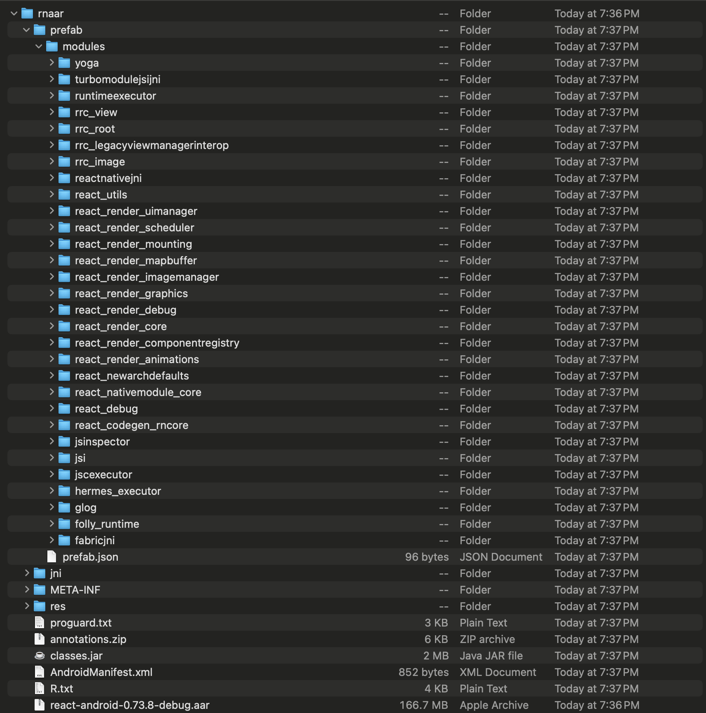

## Before RN 71, android `.aar` was bundled in the `react-native` npm package

```
android
└── com
    └── facebook
        └── react
            └── react-native
                ├── 0.70.0
                │   ├── react-native-0.70.0-debug-sources.jar
                │   ├── react-native-0.70.0-debug.aar
                │   ├── react-native-0.70.0-release-sources.jar
                │   ├── react-native-0.70.0-release.aar
                │   ├── react-native-0.70.0.module
                │   └── react-native-0.70.0.pom
                ├── maven-metadata.xml
                ├── maven-metadata.xml.md5
                ├── maven-metadata.xml.sha1
                ├── maven-metadata.xml.sha256
                └── maven-metadata.xml.sha512
```

## After RN 71, android `.aar` is fetched via maven-central

Maven central package - https://mvnrepository.com/artifact/com.facebook.react/react-android

Also it adopts **prefab** for android `.aar` packaging. Which involves prefab packaging - https://google.github.io/prefab/#package-metadata 

Shape is as below:


## After RN 71, hermes `.aar` has also be moved to maven-central

Hermes Engine Android - Coordinates `com.facebook.react:hermes-android`
https://mvnrepository.com/artifact/com.facebook.react/hermes-android is the maven central package for hermes-android build.


