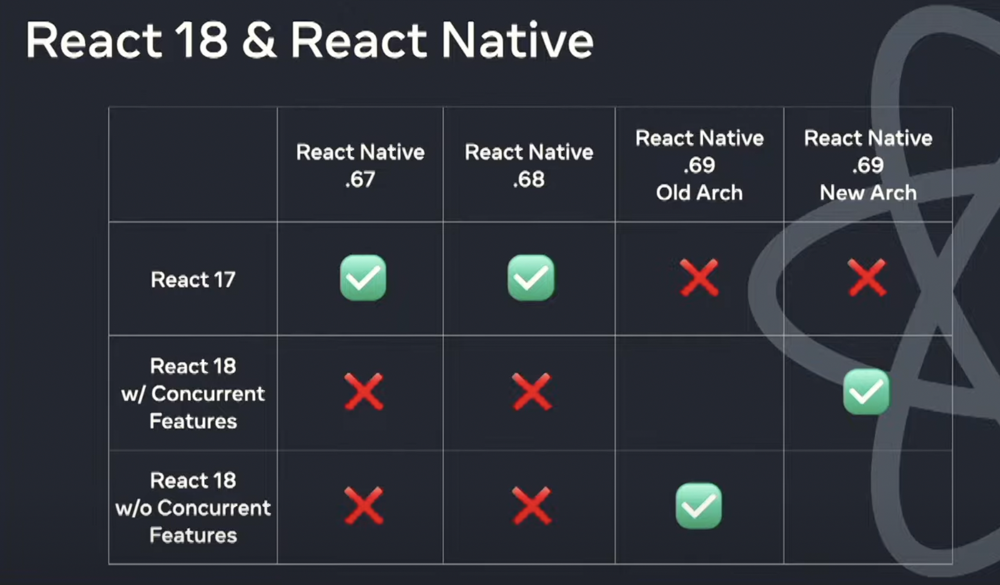

## State of React & React native evolution


State of react 18 and new react architechture



##
React Native Android:

You should send events from a native module using (.emit):
```
    getReactApplicationContext().getJSModule(RCTDeviceEventEmitter.class)
        .emit("geolocationError", PositionError.buildError(code, message));

```

You can send events from a native view component using (extending uiManager Event class) use receiveEvent:
The event name topChange maps to 
the onChange callback prop in JavaScript (mappings are in UIManagerModuleConstants.java)
or you can specify your own mapping by overriding a method in native view component
```

/**
 * Event emitted by a ReactSwitchManager once a switch is fully switched on/off
 */
/*package*/ class ReactSwitchEvent extends Event<ReactSwitchEvent> {

    public static final String EVENT_NAME = "topChange";

    private final boolean mIsChecked;

    public ReactSwitchEvent(int viewId, boolean isChecked) {
        super(viewId);
        mIsChecked = isChecked;
    }

    public boolean getIsChecked() {
        return mIsChecked;
    }

    @Override
    public String getEventName() {
        return EVENT_NAME;
    }

    @Override
    public short getCoalescingKey() {
        // All switch events for a given view can be coalesced.
        return 0;
    }

    @Override
    public void dispatch(RCTEventEmitter rctEventEmitter) {
        rctEventEmitter.receiveEvent(getViewTag(), getEventName(), serializeEventData());
    }

    private WritableMap serializeEventData() {
        WritableMap eventData = Arguments.createMap();
        eventData.putInt("target", getViewTag());
        eventData.putBoolean("value", getIsChecked());
        return eventData;
    }
}
```

use of requireNativeComponent ???


* EventDispatcher.java
sys tag : "DispatchEventsRunnable" (N->JS)
Simply calls Event.dispatch() which does evEmitter.receivEvent on all collected events from UI thread

* RN installed frame callbacks:
1. ScheduleDispatchFrameCallback 
2. DispatchUIFrameCallback
